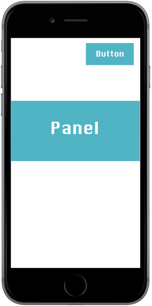

# React Native Toggle Panel

This module for React Native enables a simple yet powerful toggle panel for your React Native app.

## Unique(ish) features

### Use your own toggle component

The React Native Toggle Panel is not an accordion layout which is constrained to a top bar which you tap to collapse content. Instead, you're able to set any toggle you like, and simply pass a toggle state to the component. This means you're able to place your toggle button anywhere on your UI:



### Animates to content height dynamically

If you've ever tried doing this yourself you'll know how it's not the easiest thing to do. If set to animate, the React Native Toggle Panel will animate the panel to any contained height so there's no worry about jerky, off-putting animations.

## Customisation

Another nice feature is the flexible parameters for customisation avaliable:

* **position**: (string) `absolute` or `relative`
* **padding**: (int) panel padding
* **background color**: (string) colour of panel background
* **isAnimated**: (bool) whether animation is applied on transition - fade currently but working on slide/fade too

## Example

```javascript
import TogglePanel from './TogglePanel';

class Parent extends Component {
  constructor(props) {
    super(props);
    this.state = {
      panelToggle: true
    };
  }

  _panelTogglePress() {
    this.setState({
      panelToggle: !this.state.panelToggle
    });
  }

  render() {
    return (
      <Button onPress={() => this._panelTogglePress()} title={'Toggle'} />
      <CollapsiblePanel
        collapsed={this.state.panelToggle}
        position="relative"
        panelPadding={10}
        panelBackground="#ffffff"
        isAnimated={true}
      >
        <Text>Content</Text>
        <Text>Content1</Text>
        <Text>Content2</Text>
        ...
      </CollapsiblePanel>
    )
  }
}
export default Parent;

```
